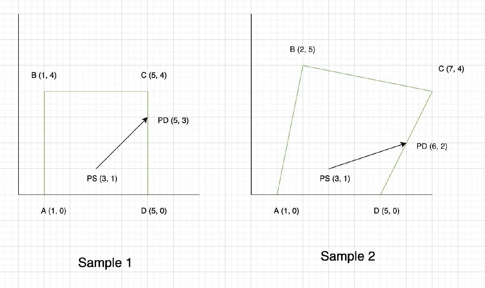

# Problem 038
Write a program which calculates the path a light ray will follow
within a closed space, aka, Ray Tracing in computer graphics.

Input contains 7 lines. The first 4 lines are vertixes of a quadrilateral.
The 5th input is the starting point of light ray and the 6th line is the
first destination of light ray. The last input is the number of encounters
of the light ray with container edges.
For each encounter, print the x and y of the encounter point.
Assume that starting point is always within the container.



# Persian Description
برنامه ای بنویسید که مسیر حرکت یک پرتو نور را در داخل یک فضای بسته تعیین کند. در گرافیک کامپیوتری به این روش Ray Tracing می گویند.

ورودی شامل ۷ خط هست. چهار خط اول راس های یک چهار ضلعی هستند. پنجمین ورودی نقطه شروع حرکت پرتو و ششمین ورودی مقصدی هست که پرتو به سمت آن حرکت می کند. در نهایت آخرین ورودی تعیین کننده تعداد برخوردهای پرتو نور با دیواره ی های این فضا هست که باید محاسبه شود. به ازای هر برخورد پرتو نور با دیواره، مختصات محل برخورد را به صورت x , y چاپ کنید.
 نقطه شروع پرتو حتما داخل چهار ضلعی قرار دارد.

# Sample Input/Output

## Input:
```
1, 0
1, 4
5, 4
5, 0
3, 1
5, 3
10
```

## Output: 
```
```