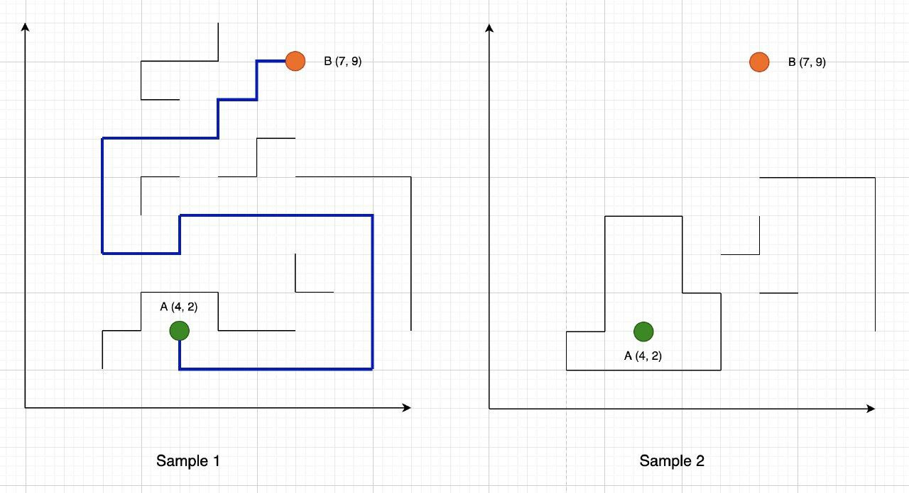

# Problem 042
Write a program to find a route between two points in the coordinates system. There are some obstacles in the grid which must be avoided.

First line of input is T number of cases.
For each case, the first line contains two (x,y) positions, for source and destination points. Next line of input is M, the number of obstacles.
In the next M lines, obstacle points are provided which may form a complex obstacle in the grid.



# Persian Description
برنامه ای بنویسید که برای دو نقطه ورودی، یک مسیر از نقطه اول به نقطه دوم پیدا کند. مسیر شامل موانعی هست که در M خط دریافت می شود.
پس از دریافت دو نقطه، یک ورودی عدد M وارد می شود و بعد از آن M خط شامل موانع مربوط به هر کیس وارد می شود. 
در صورتی که مسیری از نقطه اول به نقطه دوم وجود دارد نقاط مسیر و در غیر این صورت IMPOSSIBLE چاپ شود.

# Sample Input/Output

## Input:
```
2

(4, 2) (7, 9)
6
(2, 1) (2,2) (3,2) (3,3) (4,3) (5, 3) (5,2) (6,2) (7,2)
(7,4) (7,3) (8,2)
(10,2) (10,3) (10,4) (10,5) (10,6) (9,6) (8,6) (7,6)
(7,7) (6,7) (6,6) (5,6)
(3,5) (3,6) (4,6)
(4,8) (3,8) (3,9) (4,9) (5,9) (5,10)

(4, 2) (7,9)
4
(8,3) (7,3)
(7,5) (7,4) (6,4)
(7,6) (8, 6) (9,6) (10,6) (10,5) (10,4) (10,3) (10,2)
(6,1) (6,2) (6,3) (5,3) (5,4) (5,5) (4,5) (3,5) (3,4) (3,3) (3,2) (2,2) (2,1) (3,1) (4,1) (5,1)
```

## Output: 
```
Case #1
(4,2) (4,1) (5,1) (6,1) (7,1) (8,1) (9,1) (9,2) (9,3) (9,4) (9,5) (8,5) (7,5) (6,5) (5,5) (4,5) (4,4) (3,4) (2,4) (2,5) (2,6) (2,7) (3,7) (4,7) (5,7) (5,8) (6,8) (7,8) (7,9)
Case #2
IMPOSSIBLE
```